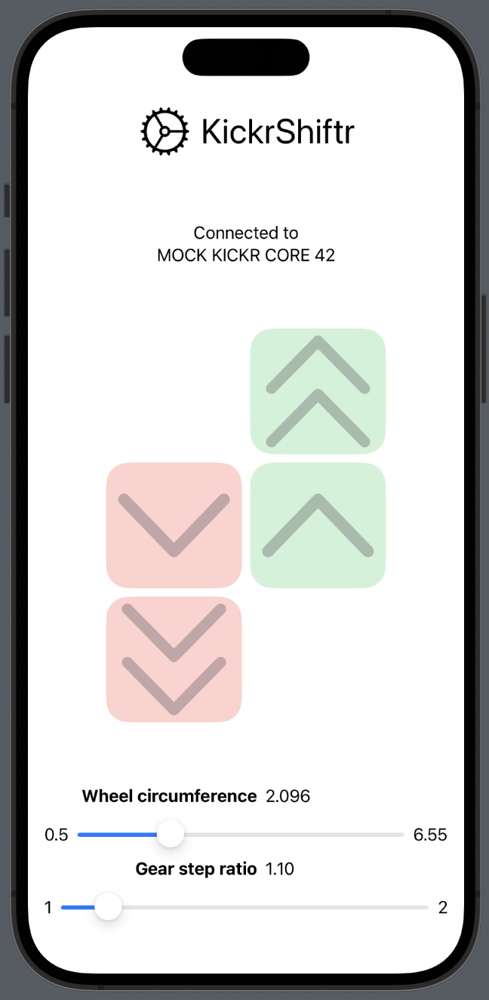
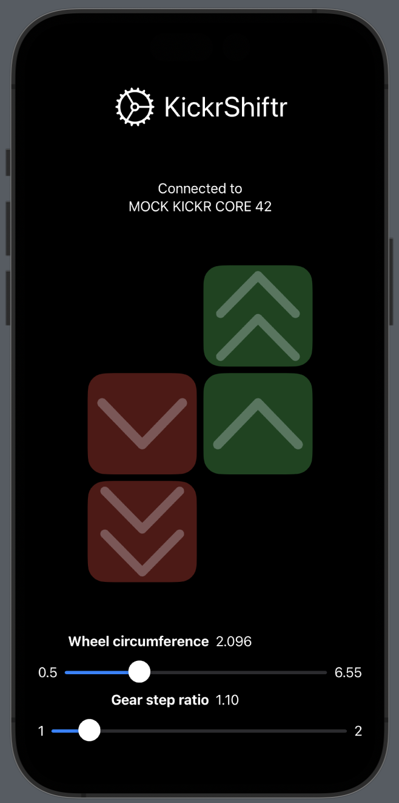

# KickrShiftr


## Why ?

Wahoo KICKR Core does not currently support virtual shifting on Zwift.

For various reasons, I was interested in this feature, in order to lower the noise generated by my trainer at high speeds and to simplify the process of reindexing my shifters when putting the bike on or off the trainer.

I noticed that the Wahoo iPhone app allows to set wheel circumference.

The goal of KickrShiftr is to emulate virtual shifting by changing the wheel circumference on-demand. Making the wheel 10% is a good enough proxy of making the chainring/cog ratio 10% bigger (i.e shifting up a gear)

## Supported platforms

The wheel circumference setting in unrelated to Zwift.

KickrShiftr connects to the KICKR Core directly to manage the wheel circumference, and does not interfere with resistance setting. 

It should be usable in combination with any training software. I only tested it with Zwift.

## Protocol used

KickShiftr connects to the KICKR Core directly to modify the wheel circumference.

Although there are official mechanisms to set the wheel circumference on cycling trainers, KICKR does not follow it and uses its own proprietary mechanism. Different UUID/characteristic.

I have used a bluetooth sniffer to determine what the Wahoo app was doing and emulated it.

Technically speaking, here are the important bits :

- Bluetooth service "Cycling Power" UUID=1818
- Custom Wahoo characteristic UUID=A026E005-0A7D-4AB3-97FA-F1500F9FEB8B
- Value set by using a write request of three-byte: 0x48 then 2-byte little endian integer circumference (in tenths of millimeters).
```
        let data : [UInt8] = [
            0x48,
            UInt8(value & 0xff),
            UInt8(value >> 8)
        ]
```
- Current value cannot be retrieved from the trainer
- Due to the unit used, max circumference is 6.5535 meters (can be limiting on flats if one uses the largest cog and smallest ring)

## Screenshots




## Useful links

- https://www.bluetooth.com/specifications/specs/fitness-machine-service-1-0/
- https://www.bluetooth.com/specifications/specs/fitness-machine-profile-1-0/

## Bluetooth sniffing

Here are the messages seen by packetLogger when the wahoo app updates the wheel circumference


